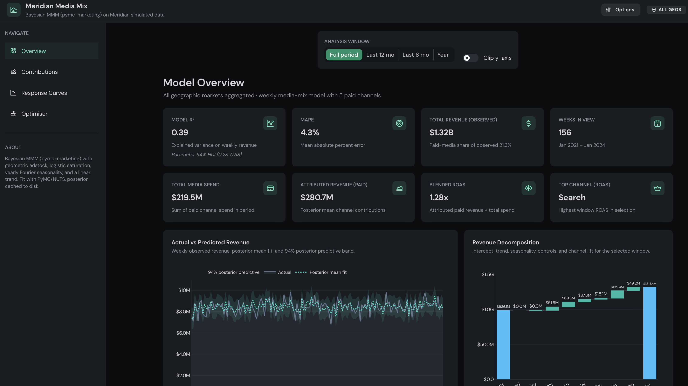
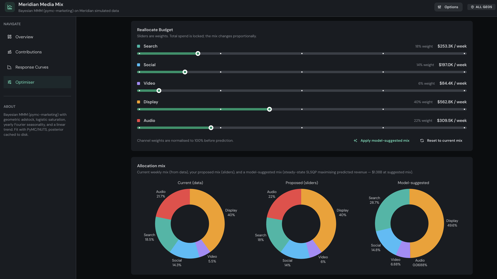

# MMM Dashboard

A local web dashboard built in [Dash](https://dash.plotly.com/) for **Bayesian Media Mix Modeling (MMM)**. It fits a hierarchical MMM on sample marketing data, then explores channel effects, budget trade-offs and optimisation in an interactive UI.

## Screenshots

<table>
  <tr>
    <td></td>
    <td></td>
  </tr>
  <tr>
    <td align="center"><em>Overview dashboard</em></td>
    <td align="center"><em>Budget optimiser view</em></td>
  </tr>
</table>

## What it does

The app uses [PyMC-Marketing](https://www.pymc-marketing.io/) to estimate a multidimensional MMM with geometric adstock and logistic saturation on paid media spend, plus controls & seasonality. Inference is **NUTS** (Hamiltonian Monte Carlo) and posteriors are summarised with [ArviZ](https://python.arviz.org/).

**Data:** On first run it downloads Google [Meridian](https://github.com/google/meridian)’s simulated `geo_all_channels.csv` and caches it under `data/`. This is synthetic multi-geo weekly data for demo purposes.

**Caching:** Fitted `InferenceData` is written to `data/mmm_idata.nc` (& a fingerprint file) so later launches reload the posterior instead of resampling unless you refit or invalidate the cache. This saves quite a lot of time, implemented for Streamlit-like behaviour.

## Pages

| Route | Purpose |
|--------|---------|
| **Overview** | KPIs, fit diagnostics, revenue vs. baseline/media decomp over time |
| **Contributions** | Channel contribution to revenue (posterior uncertainty) |
| **Response curves** | Marginal response / saturation curves by channel |
| **Optimiser** | Budget scenarios and recommended channel allocation derived from the fitted model |

The header **Options** panel lets you adjust sampler settings like draws, tuning steps and target accept (with more to be added in the future) and trigger a **refit**. Successful runs persist settings to `data/mmm_sampler_config.json`.

## To Add

- File upload and mapping mechanism / make more UI friendly (at the moment, the data is uploaded all through backend)
- Adding more user options to adjust MMM/sampler settings

## Stack

- **UI:** [Dash](https://dash.plotly.com/) 4.x, [Dash Mantine Components](https://www.dash-mantine-components.com/), [Plotly](https://plotly.com/python/) figures  
- **Model:** `pymc-marketing`, PyMC, optional **nutpie** + **JAX** for sampling throughput  
- **Python:** 3.10+ recommended (match your `pymc-marketing` wheel availability)

## Run locally

```bash
python -m venv .venv
source .venv/bin/activate   # Windows: .venv\Scripts\activate
pip install -r requirements.txt
python app.py
```

Open **http://127.0.0.1:8050**. The first model fit can take on the order of a minute while NUTS runs. Subsequent starts are faster when the NetCDF cache is present.

## macOS note

PyMC/PyTensor may need a working C++ toolchain or fall back to pure NumPy modes. The project sets a local PyTensor compile dir and, on Apple systems, can disable the C++ compiler unless `PYTENSOR_CXX` points to a working compiler. If sampling fails, check PyMC/PyTensor docs for your OS version.

## Disclaimer

This repository is a **demo** built on **simulated** data. Don't treat its outputs as business decisions without validating on your own data, priors and governance!
