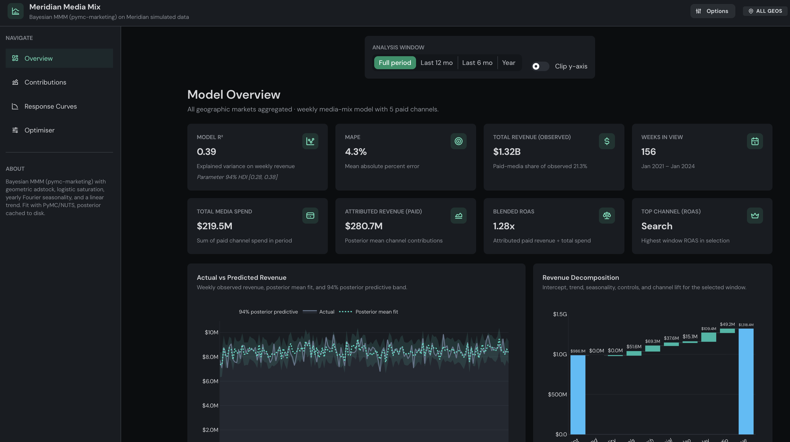
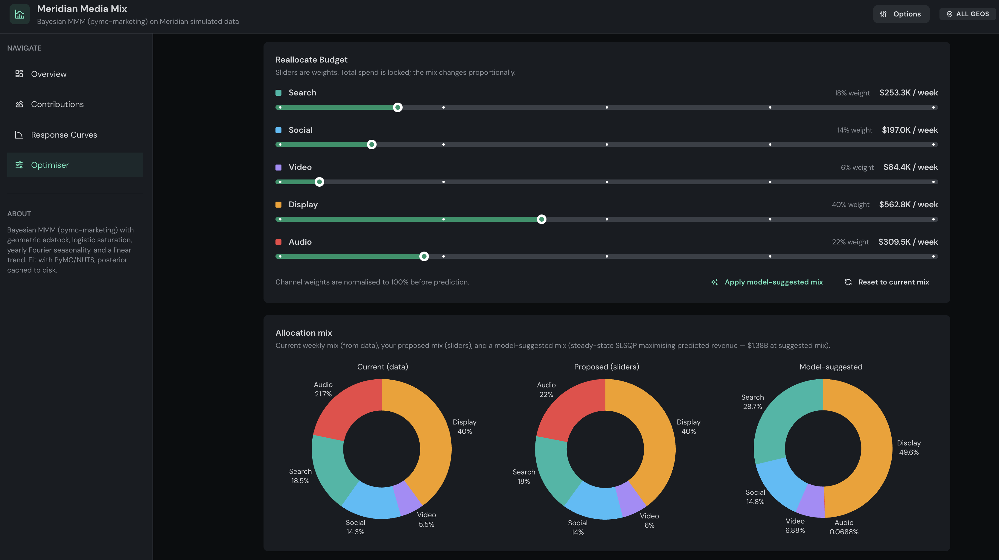

# MMM Dashboard

[](https://www.python.org/)
[](https://dash.plotly.com/)
[](https://www.pymc-marketing.io/)
[](https://www.pymc-marketing.io/)
[](https://plotly.com/python/)
[](https://github.com/pymc-devs/nutpie)
[](https://github.com/astral-sh/uv)
[](https://github.com/google/meridian)
[](LICENSE)

A web dashboard built in [Dash](https://dash.plotly.com/) for **Bayesian Media Mix Modeling (MMM)**. It fits a Bayesian MMM on one sample territory (from the Google Meridian simulated dataset), then explores channel effects, budget trade-offs and optimisation in a clean UI with interactive elements.

## Screenshots

<table>
  <tr>
    <td></td>
    <td></td>
  </tr>
  <tr>
    <td align="center"><em>Overview dashboard</em></td>
    <td align="center"><em>Budget optimiser view</em></td>
  </tr>
</table>

## What it does

The app uses [PyMC-Marketing](https://www.pymc-marketing.io/) to estimate a multidimensional MMM with geometric adstock and logistic saturation on paid media spend, plus controls & seasonality. Inference is **NUTS** and posteriors are summarised with [ArviZ](https://python.arviz.org/).

**Data:** On first run it downloads Google [Meridian](https://github.com/google/meridian)’s simulated `geo_all_channels.csv` and caches it under `data/`. This is synthetic multi-geo weekly data; the app automatically selects the largest territory by revenue (`Geo36` in the bundled file) and models that one territory only.
The meridian data has generic names for channels ("Channel1" etc), so these have been mapped to actual channel names like "Video", "Social" etc. for demonstration purposes.

**Caching:** Fitted inference data is written to `data/mmm_idata.nc` (and a fingerprint file) so later launches reload the posterior instead of resampling unless you refit or invalidate the cache, to save on (re)loading time.

## Pages

| Route | Purpose |
|--------|---------|
| **Overview** | In-sample KPIs, recent in-sample diagnostics, revenue vs. baseline/media decomp over time |
| **Contributions** | Channel contribution to revenue (posterior uncertainty) |
| **Response curves** | Marginal response / saturation curves by channel |
| **Optimiser** | Steady-state budget scenarios with optional channel min/max constraints |

The **Options** panel in the header lets you adjust sampler settings like draws, tuning steps and target accept (with more to be added in the future) and trigger a refit. Successful runs persist settings to `data/mmm_sampler_config.json`.

## To Add

- Adding more user options to adjust MMM/sampler settings
- Multi-geo / hierarchical geo modelling capability

## Stack

- **UI:** [Dash](https://dash.plotly.com/) 4.x, [Dash Mantine Components](https://www.dash-mantine-components.com/) 
- **Model:** `pymc-marketing`, **nutpie** & **JAX** for sampling throughput  
- **Python:** 3.13+ recommended
- **Package manager:** [uv](https://github.com/astral-sh/uv) (used for dependency management)

## Run locally

```bash
uv sync
uv run app.py
```

Open **http://127.0.0.1:8050**. The first model fit can take around a minute or two while NUTS runs, subsequent starts should be faster.


## Disclaimer

This repository is a demo built on Google Meridian simulated data. Don't treat its outputs as business decisions without validating on your own data!


## License

MIT. See [LICENSE](LICENSE).